# Task2_A"  
    

**We started with creating a project tree**  
    

**We started with filling our classes with code starting with `Domain/product`**  
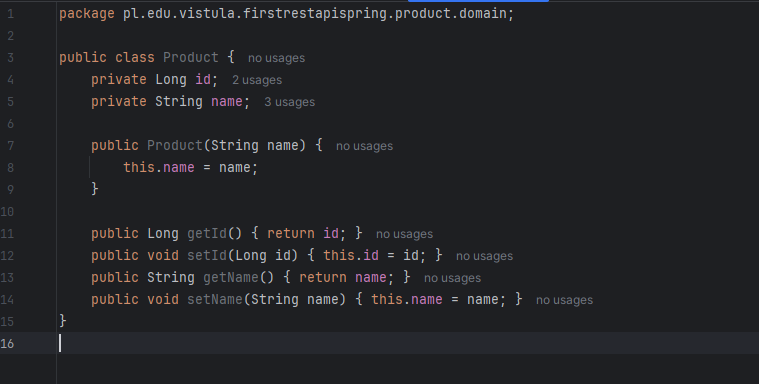    

`private Long id;` This will be the unique identifier for the product  
`private String name;` The name of the product  
`public Product(String name) { this.name = name; }` This is a parameterized constructor used to create a new instance of the Product class with a specific name  
`public Long getId() { return id; }` This method is used to retrieve the unique identifier (id) of a product  
`public void setId(Long id) { this.id = id; }` This method allows the application to assign or change the id of a product  
`public String getName() { return name; }` This method retrieves the current name of the product  
`public void setName(String name) { this.name = name; }` This method is used to set or update the name of the product    

**We are filling the `Repository/ProductRepository`**  
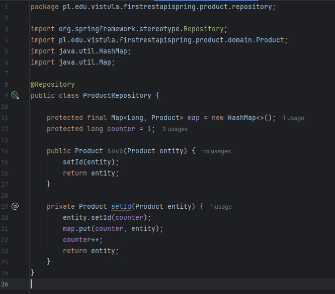    

`@Repository:` Tells Spring this class communicates with the data storage  
`Map<Long, Product>:` Acts as our "temporary database"  
`counter:` Ensures every product saved has a unique, incrementing ID  
`save():` The standard method name used in Spring for adding or updating data  

We are filling the `Api/ProductRequest` and `Api/ProductResponse`  
    
    

`ProductRequest:` uses the @JsonCreator annotation, which tells the Jackson library (built into Spring) how to create this Java object from JSON text  
`ProductResponse:` Unlike the request, the response includes the ID generated by our "database" so the user knows which ID was assigned to their new product   

**Why two classes?:** We separate them because the user provides the name (Request), but the server provides both the name and the generated ID (Response)    

We are filling the `support/ProductMapper`  
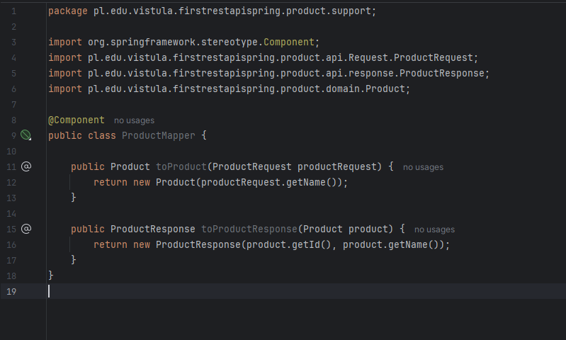    

**Why use a Mapper?:** It keeps your code clean by separating the data formats used by the "outside world" (API) from the internal data formats (Domain).  
`@Component`: This makes the class a Spring Bean, allowing the ProductService to use it automatically through dependency injection.    

We are filling the `service/ProductService`  
    

`Dependency Injection:` We use the constructor to bring in the Repository and Mapper, ensuring the Service has all the tools it needs  
`Business Logic Flow:` The create method handles the logic of transforming an incoming request into a database entity and then into a user-friendly response  
`Encapsulation:` The Service layer ensures the Controller doesn't have to deal with the Repository directly, which is a key part of professional software architecture    

We are filling the `response/ProductController`  
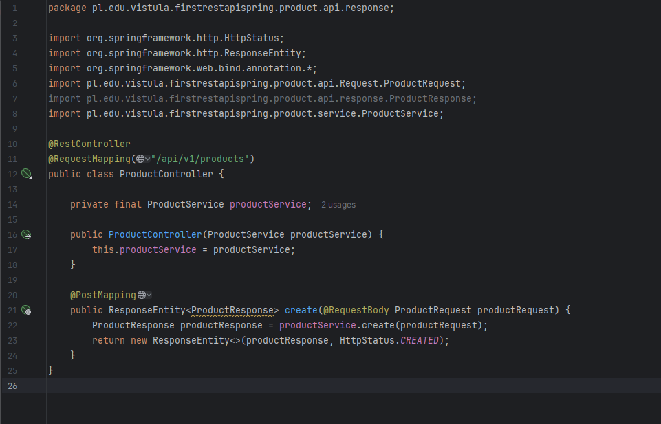    

`Request Handling:` The `@RequestBody` annotation is the mechanism that "rewrites" JSON data into a Java object  
`Response Status:` We use 201 Created because it is the standard HTTP success code for a resource being saved correctly  
`Flow:` The controller receives the request, passes it to the ProductService, and wraps the result in a ResponseEntity for the client    

We downloaded post and tested the API in postman in the screenshot you can see the result  
    

We add `find method` the `Repository/ProductRepository`  
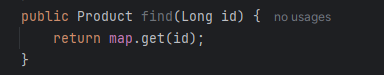    

This uses the get() method of the HashMap to quickly find the object associated with that specific ID key.    

We add `find method` the `Api/ProductController`  
    

`@GetMapping("/{id}"):` This tells Spring to handle GET requests at `/api/v1/products/{id}`  
`@PathVariable:` This takes the value from the URL (the {id} part) and converts it into the Java variable id so the service can use it to search the HashMap    

We update `find method` in the `repository/ProductRepository`  
    

`Optional.ofNullable:` This wraps the result. If the product exists, it contains the product; if not, it returns an "empty" Optional instead of a crash-prone null.    

We update `Optional find` in the `service/Productservice`  
    

`.orElseThrow():` This tells the code: "Give me the product if it's there, otherwise stop and throw an error"    

# Task2_B"  
    

To enable Swagger we must add a specific library to our pom.xml file after doing that we can reload the maven project   
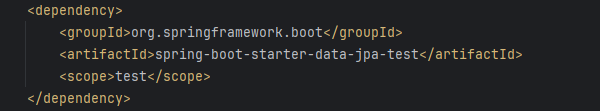    

We added `findALL  method` in the `repository/ProductRepository`  
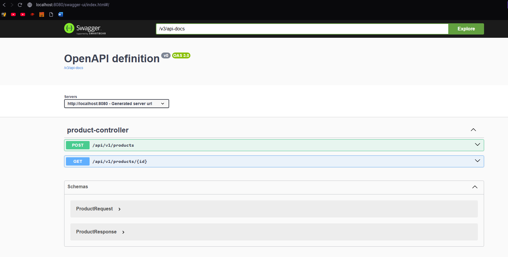    
It will let us converts the collection of products stored in our HashMap into a List format that Java can easily loop through.    

screenshot of `localhost:8080/swagger-ui/index.html` and `localhost:8080/v3/api-docs`
    
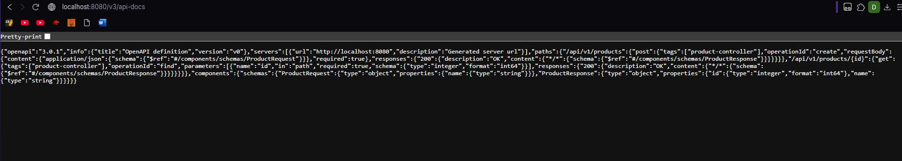    

# Task2_C"  
    

We added required Imports and inserted the GET method code  
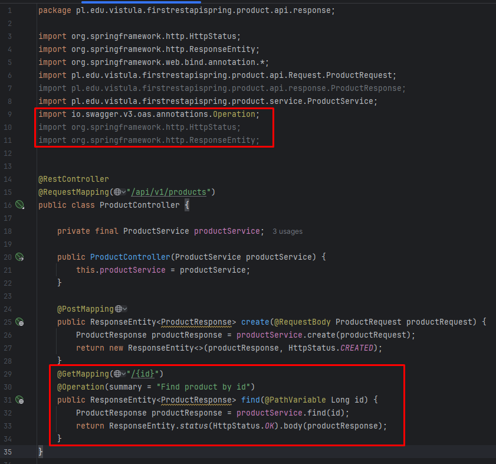    
`@GetMapping("/{id}"):` This annotation maps HTTP GET requests to /api/v1/products/{id}.  
`@PathVariable Long id:` This tells Spring to extract the ID value from the URL and pass it into the method.  
`@Operation:` This is a Swagger annotation that describes the endpoint in our UI    

We update the code in the `ProductService`  
    
`What it does:` It asks the repository for a product by its ID. If the product exists, it uses the ProductMapper to change the Product object into a ProductResponse. If it doesn't exist, it throws an exception.  
after that we update the repository layer  
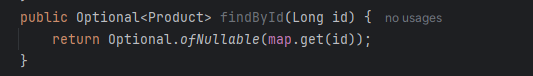    

**GET - Find Product by ID**  
    
The endpoint allows the user to retrieve a specific product from the "database" by providing its unique ID in the URL path in our case `http://localhost:8080/api/v1/products/1`.    

**overview of Task2_C**  

`Endpoint Definition:` The find() method in our controller is responsible for handling the request because it is marked with the @GetMapping("/ {id}") annotation  
`Path Variables:` The {id} in the URL is a placeholder for the resource identifier.  
`Mapping the ID:` Spring automatically assigns the value from the URL (`http://localhost:8080/api/v1/products/1`) to the Long id parameter in our Java method.  
`The Role of @PathVariable:` This assignment happens because the parameter is marked with the @PathVariable annotation and shares the same name ("id") as the attribute in the @GetMapping annotation.  
`Next Action:` Once the ID is captured, the controller calls productService.find(id) to begin the data retrieval process.  
**To meet the requirement of detailing all use cases, we're adding a note about the current error state:**  
`Error Handling (Current):` Currently, requesting an invalid ID returns an HTTP 500 error. this will change in the future of our code.     

# Task2_D"  
    

We created `ProductNotFoundException` Class inside `exception` package  
    

We added code in the class  
    
`ProductNotFoundException` ensures that when a user searches for a product ID that does not exist, the system generates a clear, formatted message rather than a generic crash    

We created `ProductExceptionSupplier` Class inside `support` package  
    

We added code in the class  
    
`ProductExceptionSupplier` allows you to add more product-related exceptions in the future in one central place.    

We created `ProductExceptionAdviso` Class inside `support` package  
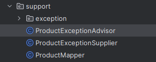    

We added code in the class  
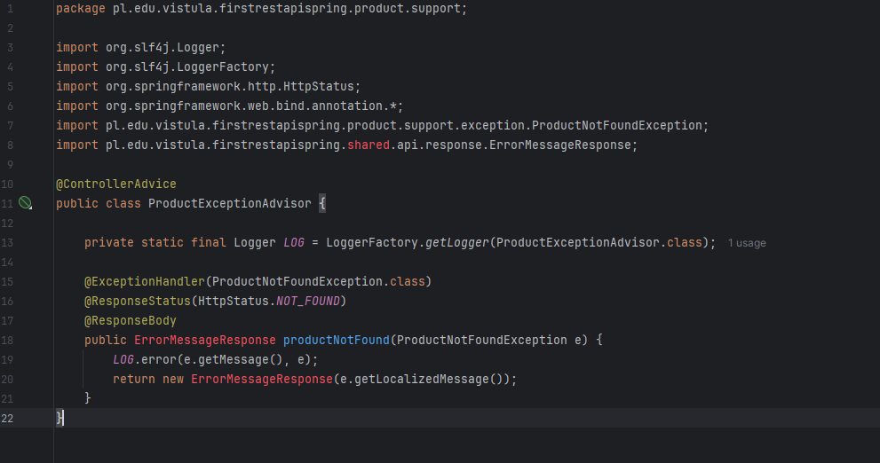    

`@ControllerAdvice:` Tells Spring this class handles exceptions globally.   
`@ExceptionHandler:` Specifies that this method only triggers when a ProductNotFoundException occurs.  
`@ResponseStatus(HttpStatus.NOT_FOUND):` This is what changes the HTTP status code from 500 to 404.  
`ErrorMessageResponse:` This is a wrapper class for the error message    

We created `SharedApiResponse` package outside of product and `ErrorMessageResponse` class  
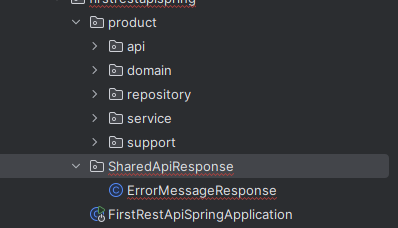    

We added code in the class  
    
This class is a simple wrapper (POJO) used to store an error message as a final string, providing a standardized JSON structure for the API's error responses.    

# Task2_E"  
    

We added a new method to ProductController to handle update requests. This method uses the @PutMapping annotation with a path variable for the product ID.  
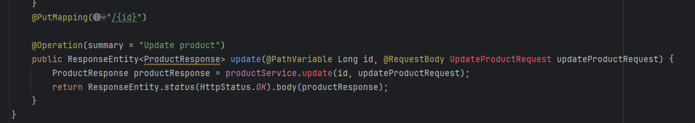    

We created `UpdateProductRequest` class in `Request` package  
    

We added code in the class  
    

We implemented the update method within the `ProductService` class.   
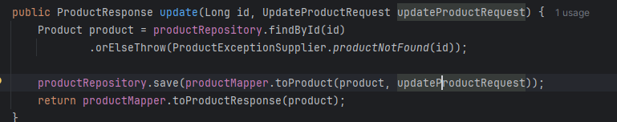    
The `update` method in the `ProductService` class retrieves an existing product by its ID, uses a specialized mapper to apply the updated data from the request, and then persists the changes back to the repository.   

We are solving the compilation error in the service layer by updating the `ProductMapper` class to handle the mapping of an existing product with new data.  
    

We updated the logic in `ProductRepository` to handle updates correctly.  
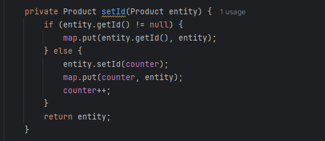    
**Why ?** This ensures that if the product already has an ID (an update), it just saves it to the map. If it doesn't (a new product), it generates a new ID using the counter.    

# Task2_F"  
    

We added code in the class `ProductController`  
    
This controller method maps HTTP DELETE requests to a specific product ID, delegating the removal logic to the service layer and returning a 204 No Content status to confirm successful deletion without sending back a response body.    

We added code in the class `ProductService`  
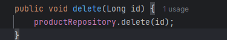    
delegates the removal task to the repository by calling its delete function with the specified product identifier    

We added code in the class `ProductRepository`  
    
executes the actual data removal by using the built-in remove function of the Java Map to delete the entry associated with the given ID.     

We added code in the class `ProductService`  
    
We updated the method with a validation step that verifies the resource's existence via findById before removal, ensuring that requests for non-existent IDs are met with a standardized 404 Not Found error response.  

We added code in the class `ProductRepositorr`  
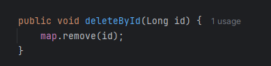    
This method simply performs a standard removal of the key-value pair from your in-memory `HashMap`.    

# Task2_G"  
    

We added code in the class `src -> main -> resources -> application.properties`  
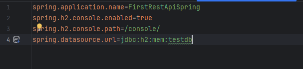    
`(enabled=true):` This turns on the web-based "H2 Console," which is a visual tool that lets you see and manage our database tables directly in a browser.  
`(path=/console/):` This defines the URL address we will use to access that console (localhost:8080/console/).  
`(url=jdbc:h2:mem:testdb):` This defines the "Schema." It ensures that every time we run the app, it uses a database with the same consistent name (testdb).    
The result  
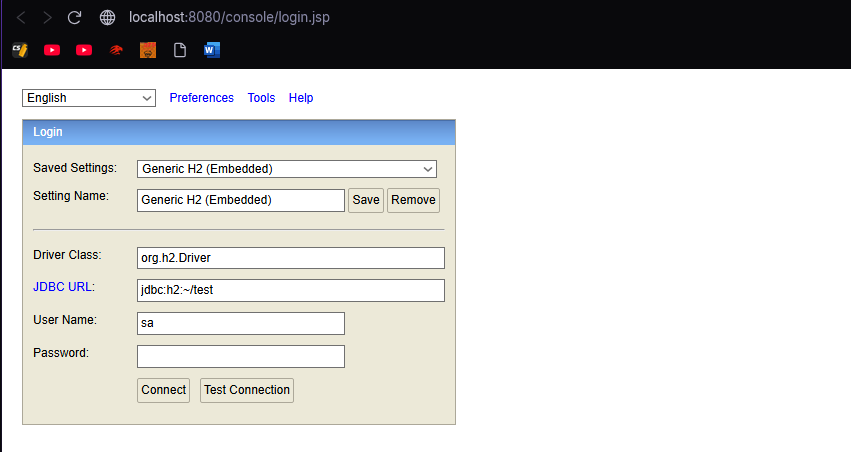    

We changed the `JDBC URL:` from default **jdbc:h2:mem:testdb** to match ours   
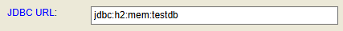    

Result after loggin in  
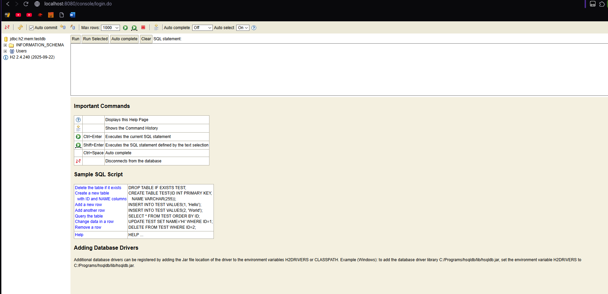    

We need to go back to our applications.properties file again and add code   
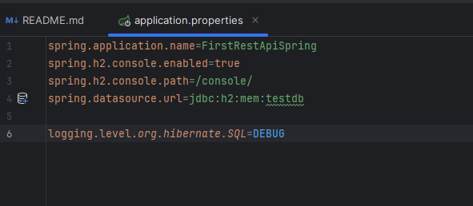    
This line tells Spring Boot to print every SQL query that Hibernate runs into our IntelliJ console   

Result   
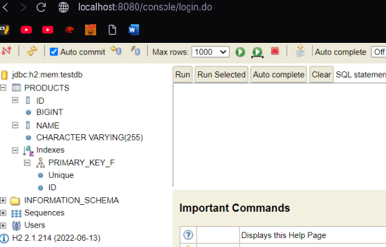    

